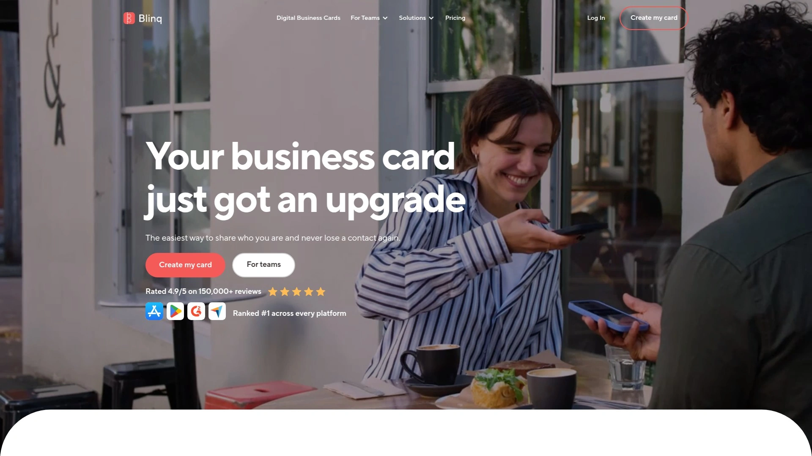
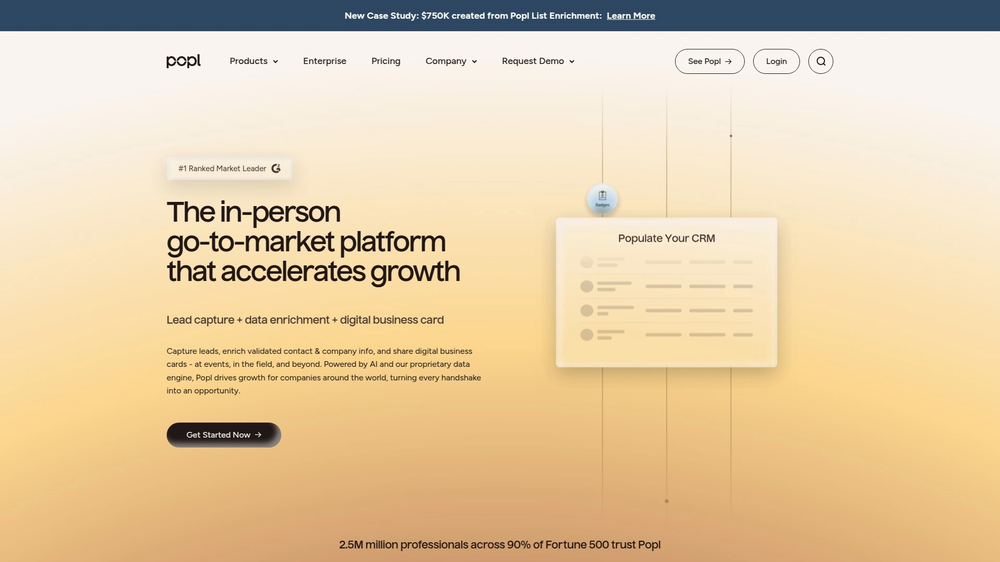
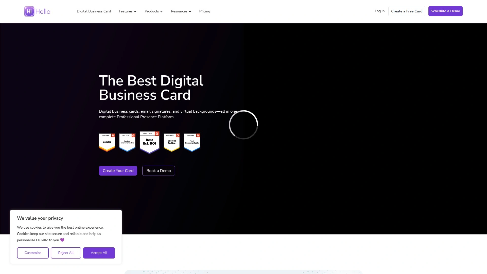
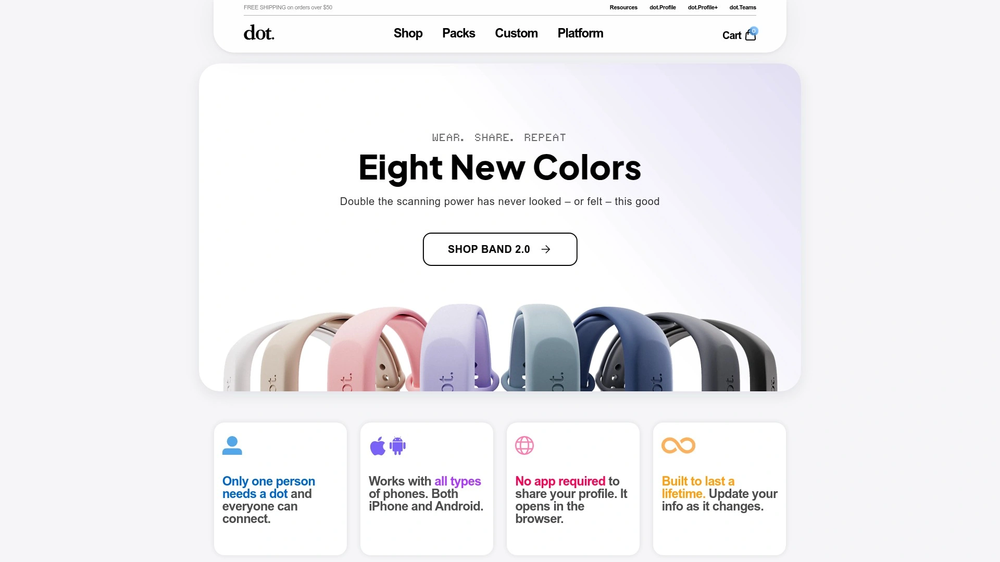
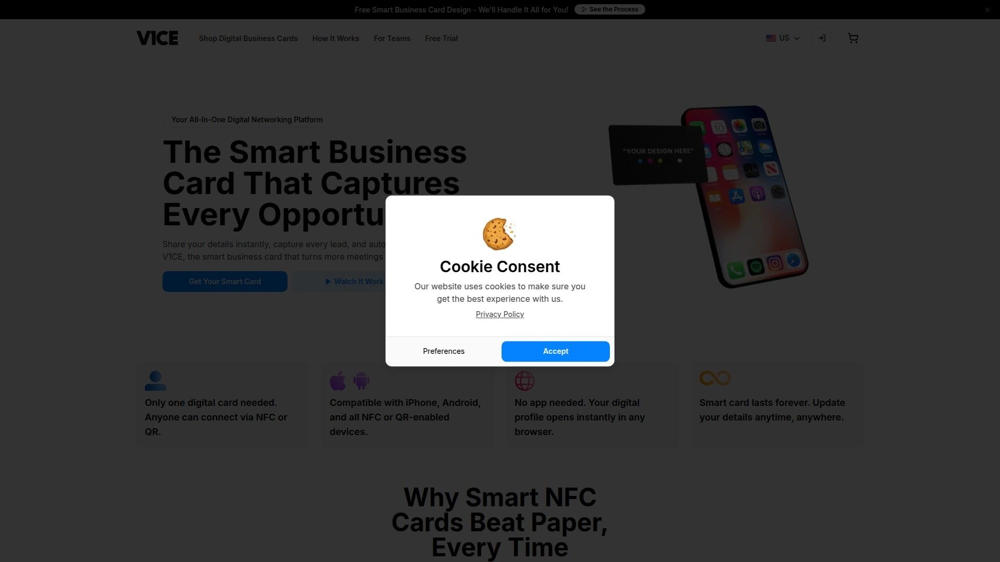
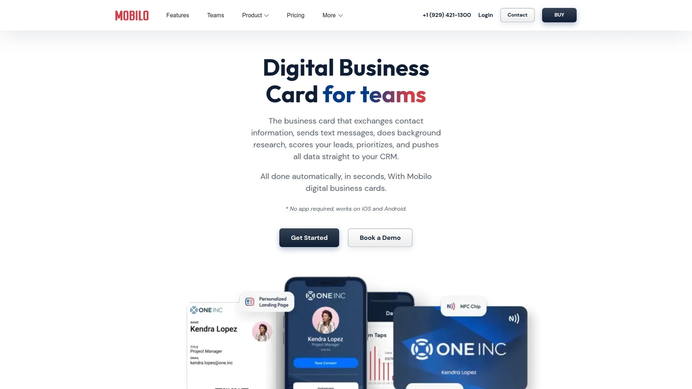

# Top 8 Best Digital Business Card Tools in 2025

Tired of that awkward moment when you've run out of paper business cards, or watching someone misspell your name while saving your contact? Switching to a digital business card streamlines your networking, making contact sharing instant and impressive. These platforms offer a modern way to connect, ensuring your details are saved correctly every time, with just a simple tap or scan.

## **[Blinq](https://blinq.me)**

Blinq is the all-rounder that makes creating and sharing your professional identity incredibly simple for both individuals and entire teams.

It strikes a perfect balance between powerful features and a user-friendly interface. You can create sleek, customizable cards in minutes and share them via QR code, NFC card, or a simple link. For businesses, Blinq shines with its ability to manage team signatures and cards from a central dashboard, ensuring brand consistency.

  * **Centralized Management:** Easily create and manage digital business cards for your entire company.
  * **Integrations:** Connects directly with CRMs like HubSpot and Salesforce to turn new contacts into leads.
  * **Highly Customizable:** Add your logo, brand colors, videos, and links to make your card truly yours.
  * **Email Signatures:** Create professional email signatures that link back to your dynamic digital card.

## **[Popl](https://popl.co)**

Popl is the brand that turned heads with its viral NFC products, making it a trendy choice for networking.

The core of Popl is its line of physical products—phone tags, cards, and keychains—that instantly share your digital profile to any smartphone. It's built for speed and making a memorable first impression. The platform also has a "lead capture" mode, which prompts the other person to enter their details, sending them directly to your phone. It’s perfect for social butterflies and event professionals who meet a lot of people.

## **[HiHello](https://hihello.com)**

HiHello offers one of the most generous free plans on the market, making it an excellent entry point into the world of virtual business cards.

Beyond just contact info, HiHello lets you embed videos, PDFs, and social links right on your card. A standout feature is their virtual backgrounds for video calls, which display your QR code so people can grab your details during a Zoom meeting. While it has robust paid plans for teams, its free offering is more than enough for most solo users to ditch paper cards for good.

## **[Dot Cards](https://dotcards.net)**

If you're a fan of minimalist aesthetics, Dot is designed for you, focusing on beautifully designed physical NFC devices.

Dot’s flagship product is the "dot," a small, adhesive NFC tag you can stick to the back of your phone. Tapping the dot on someone else's phone brings up your "dot.Profile," a clean and simple landing page with all your links. It's less about complex business features and more about creating a single, elegant hub for your entire online presence.

## **[V1CE](https://v1ce.co)**

V1CE brings a touch of luxury to digital networking with its premium, high-quality NFC cards.

Want a business card made of metal, wood, or even 24k gold? V1CE has you covered. The platform connects these stunning physical cards to a straightforward digital profile. It's the ultimate choice for professionals in industries where image and a premium feel are paramount, like real estate, luxury sales, or C-suite executives.

## **[Knowee](https://www.google.com/search?q=https://knowee.net)**

Knowee is a digital business card solution built with sales and marketing professionals in mind, focusing on data and integration.

This platform goes beyond simple contact sharing by offering detailed analytics on card views and interactions. It's designed to be a lead-generation tool. You can see who has saved your contact information and follow up accordingly. Knowee is ideal for corporate users who need to measure the ROI of their networking efforts.

## **[Mobilo Card](https://mobilocard.com)**

Mobilo is a smart card solution aimed squarely at teams and enterprises that need seamless CRM integration.

The main draw for Mobilo is its automation. It's built to pipe new contacts directly into your company's CRM, eliminating manual data entry and reducing follow-up time. With modes for sharing, exchanging, or capturing leads, it gives teams a powerful and standardized tool for networking at scale, especially at large trade shows and conferences.

## **[Tappy](https://tappy.tech)**

Tappy offers a wide variety of NFC-enabled products, from cards and tags to wristbands, making it a versatile and casual option.

Tappy is all about giving you options for how you want to share your profile. The platform itself is simple and direct, allowing you to link to a contact card, website, or any social media profile. It's a great, no-fuss solution for creators, small business owners, or anyone who wants a fun and flexible way to connect with others.

## FAQ

**How do NFC business cards actually work?**
You just tap the card or device to a compatible smartphone, and your contact profile instantly appears on their screen as a link—no app is needed for the recipient.

**Can I update my info after creating a digital business card?**
Yes, that's one of the biggest benefits. You can log into your account and edit your details in real-time, and your card or QR code will instantly link to the updated information.

**Are these platforms secure for sharing my contact information?**
Generally, yes. You control exactly what information you want to share on your public profile, and you can often update or deactivate your card at any time.

## Conclusion

Making the jump from paper to digital is a no-brainer for anyone looking to network more efficiently and make a lasting impression. These tools all offer a fantastic modern alternative to traditional business cards. For a solution that's incredibly easy to set up, scales perfectly for teams, and offers powerful integrations, [Blinq](https://blinq.me) is an excellent starting point for just about any professional.
